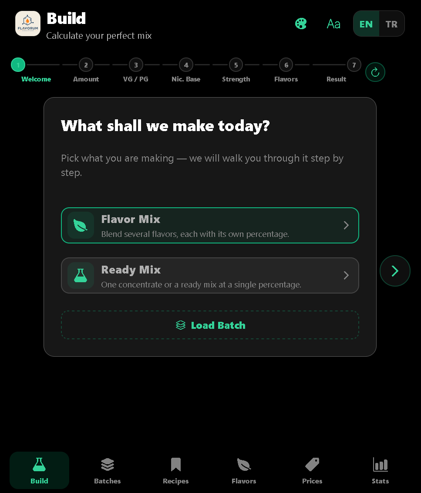
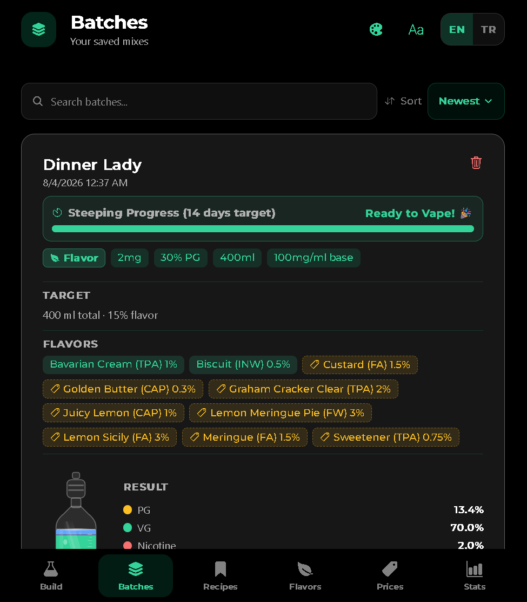
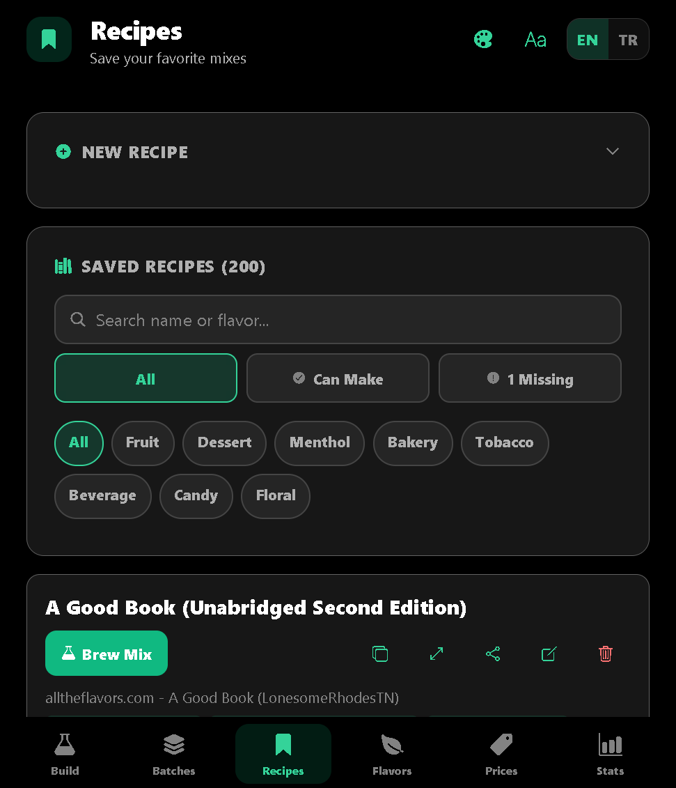
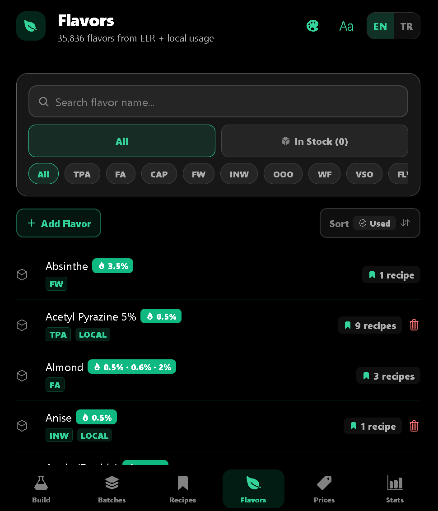
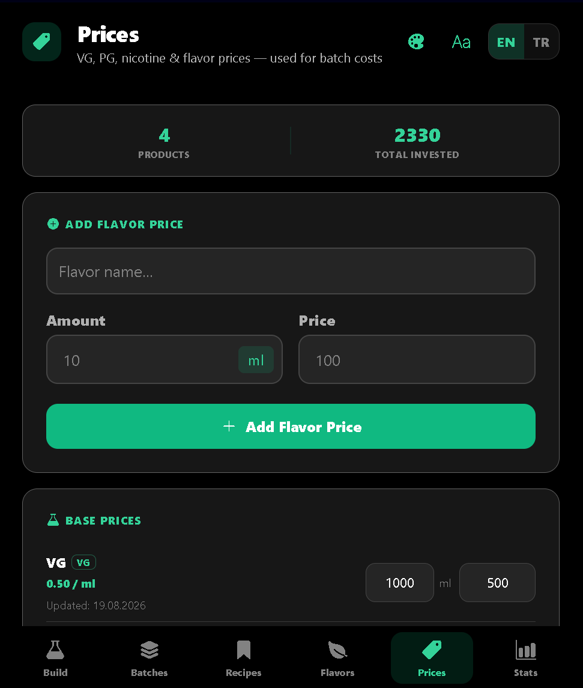
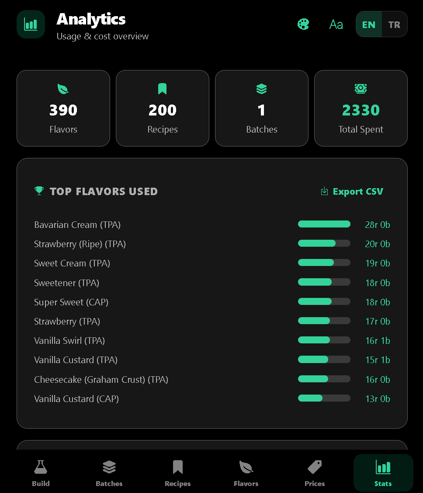

# Flavorum

DIY e-liquid recipe manager — build, track and cost your vape mixes. Built with **Expo / React Native**, runs on **Android, iOS and the web**.

All data stays on-device (AsyncStorage) — no accounts, no cloud, fully local and offline.

## Screenshots

| Build | Batches | Recipes |
| :---: | :---: | :---: |
|  |  |  |
| Assemble a mix step by step, then load a saved batch straight into the result | Batches with steeping countdown, target, flavors and result | Saved recipes with Brew, Scale, Share and “can make” filters |

| Flavors | Prices | Analytics |
| :---: | :---: | :---: |
|  |  |  |
| 35,664 flavor names with brands, usage and stock tracking | Prices that power the per-batch cost estimate | Usage totals, spend and CSV export |

## Features

- **Build** — assemble a mix from scratch: nicotine sources, target PG/VG ratio, flavor percentages (mix or flavor mode), live result breakdown and a per-batch cost hint.
- **Batches** — save your mixes as batches with:
  - Steeping countdown with a "Ready to Vape" badge and optional local notifications
  - 5-star rating and tasting notes
  - Estimated batch cost on the card, with tappable warnings for flavors / VG / PG / nicotine missing a price → jumps to Prices and pre-fills the flavor
- **Recipes** — saved recipes with one-tap **Brew**, **Duplicate**, **Scale** (ml/gram) and **Share** (copy-to-clipboard), plus "buildable with stock" and "1 missing" filters.
- **Flavors** — a local database of **35,664** flavor names with brand parsing (e.g. `Strawberry (TPA)`), brand badges and an in-stock inventory tracker.
- **Prices** — track VG / PG / nicotine base prices and per-flavor prices (bottle ml + price); powers the batch cost estimator.
- **Analytics** — flavor usage donut chart, usage totals, total spent, CSV export, and full backup / restore.
- **Themes** — 10 themes including OLED-friendly **Obsidian**, with a theme picker that flags low-contrast themes (WCAG AA).
- **i18n** — English and Turkish (UI language follows the device).

## Screens (bottom tabs)

| Tab | Screen |
| --- | --- |
| Build | `src/screens/NicotineScreen.js` |
| Batches | `src/screens/BatchScreen.js` |
| Recipes | `src/screens/RecipesScreen.js` |
| Flavors | `src/screens/FlavorLibraryScreen.js` |
| Prices | `src/screens/PricesScreen.js` |
| Analytics | `src/screens/AnalyticsScreen.js` |

## Tech stack

- [Expo](https://expo.dev) SDK 54 · React Native 0.81 · React 19
- React Navigation (bottom tabs) · react-native-web
- AsyncStorage (local persistence) · expo-notifications · expo-haptics
- react-native-svg (charts / bottle renderer) · react-native-qrcode-svg

## Getting started

```bash
npm install
npm start          # dev server
npm run android    # Android
npm run ios        # iOS
npm run web        # web (hot reload)
npm run build:web  # static web export to ./dist
```

## EAS builds (Android)

```bash
eas build -p android --profile preview    # APK (internal)
eas build -p android --profile production # AAB (store)
```

## Project structure

```
App.js                  # app shell, theming, tab navigator + desktop sidebar
src/
  screens/              # 6 screens (see table above)
  components/           # reusable UI (StickyHeader, ScreenHero, SliderInput, BottleSVG, …)
  utils/                # recipes, prices, flavors, backup, notifications, i18n helpers
  data/flavors.js       # ELR flavor database (35,664 names)
  theme.js              # layout breakpoints, scales, sidebar math
  ThemeContext.js       # theme provider + picker state
  i18n.js               # EN / TR translations
eas.json                # EAS build profiles
vercel.json             # web deployment
```

## License

MIT